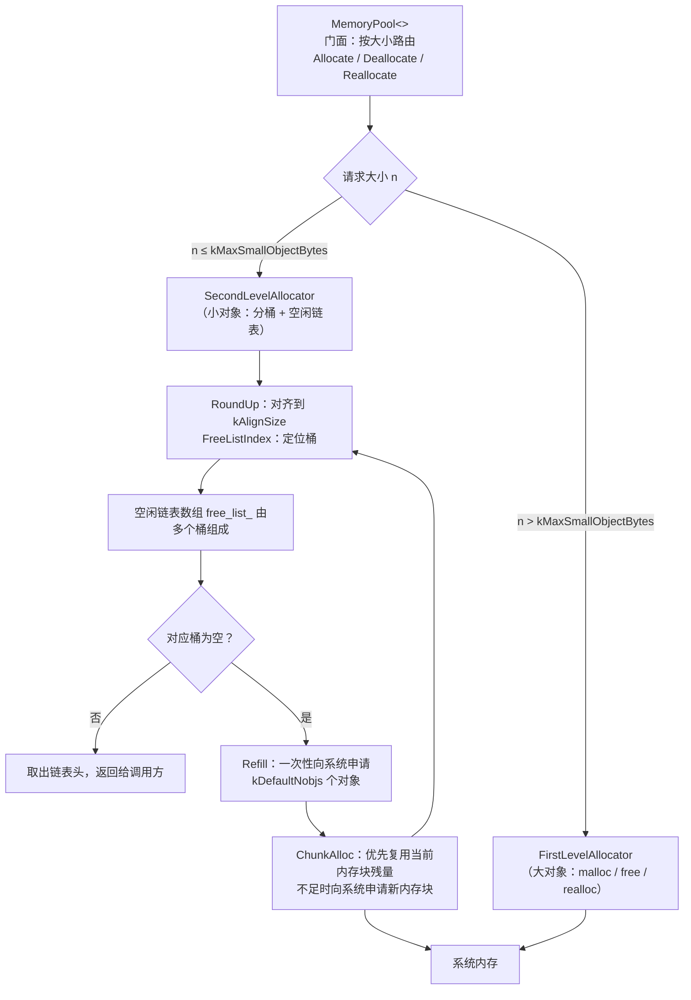

# MemSlice

> 一个轻量级、可定制的 C++20 内存池（Memory Pool）实现，内置两级分配器、STL 适配器与全局 `new`/`delete` 重载，旨在减少高频小对象分配的系统调用与内存碎片。

作者：Howland Mai　·　版权：© 2026　·　许可证：[MIT](LICENSE)


---

## 目录

- [MemSlice](#memslice)
  - [目录](#目录)
  - [简介](#简介)
  - [特性](#特性)
  - [工作原理](#工作原理)
  - [目录结构](#目录结构)
  - [构建与测试](#构建与测试)
    - [环境要求](#环境要求)
    - [构建](#构建)
    - [运行测试](#运行测试)
    - [集成到你的项目](#集成到你的项目)
  - [快速上手](#快速上手)
  - [自定义配置](#自定义配置)
  - [API 参考](#api-参考)
    - [`MemoryPool`](#memorypool)
    - [`Allocator<T>`](#allocatort)
    - [`DefaultConfig`](#defaultconfig)
  - [与 STL 容器配合](#与-stl-容器配合)
  - [性能说明](#性能说明)
  - [注意事项](#注意事项)
  - [许可](#许可)
  - [贡献](#贡献)

---

## 简介

MemSlice 是一个用 C++20 编写的现代内存池库。它采用经典的两级分配器设计：

- **一级分配器（FirstLevelAllocator）**：直接封装 `malloc` / `free` / `realloc`，处理超过阈值（默认 128 字节）的大对象。
- **二级分配器（SecondLevelAllocator）**：将小对象按对齐后的大小分桶，通过空闲链表（free list）复用内存块，仅在链表耗尽时向系统批量申请大块内存。

它同时提供：

- 一个符合 STL 分配器规范的 `Allocator<T>`，可直接作为 `std::vector`、`std::list` 等容器的模板参数；
- 可选的全局 `operator new` / `operator delete` 重载，让整个程序的常规分配都走内存池。

核心实现为纯头文件模板，零第三方依赖，只依赖 C++ 标准库。

---

## 特性

- **两级分配器架构**：小对象走内存池复用，大对象透明回落到系统分配器。
- **零额外依赖**：只有标准库，头文件即库（`memory_pool.hpp`）。
- **模板可定制**：通过 `Config` 模板参数自由调整对齐大小、小对象上限、批量申请粒度、线程安全开关。
- **内存复用与非碎片化**：基于大小分桶（bucketing）的空闲链表，释放的内存按尺寸回到对应桶，可直接复用。
- **分配失败兜底**：向系统申请失败时，会扫描空闲链表寻找可用内存，直至抛出 `std::bad_alloc`。
- **STL 分配器兼容**：内置可复用的 `Allocator<T>`。
- **可选全局重载**：可通过 `src/memory_pool.cpp` 启用全局 `new`/`delete` 加速（含 over-aligned 对齐重载）。
- **线程安全可选**：`Config::kThreadSafe` 默认开启，二级分配器加锁，可关闭以换取单线程极致性能。
- **资源可回收**：局部内存池实例析构时回收所有向系统申请的 chunk，不泄漏；对象头记录真实尺寸，无参 `delete` 亦能正确释放（全局池单例刻意不析构，见「注意事项」）。
- **纯中文注释**：代码注释全部使用中文。
- **MIT 开源许可**。

---

## 工作原理



- **分桶（Bucketing）**：`RoundUp` 用位运算把请求尺寸向上对齐到 `kAlignSize`（默认 8 字节），`FreeListIndex` 将其映射为固定桶索引。
- **批量申请（Batch Allocation）**：当某个桶为空时，`Refill` 一次向系统申请 `kDefaultNobjs`（默认 20）个对象，串成链表后按需交给调用方。
- **残量复用**：当当前 chunk 空间不足以满足整批时，会先消耗剩余空间，并把旧 chunk 的残量归还到对应桶，避免内存浪费。

---

## 目录结构

```
MemSlice/
├── xmake.lua                   # xmake 构建脚本（C++20，静态库 + 测试可执行目标）
├── README.md                   # 本文件
├── LICENSE                     # MIT 许可证
├── .gitignore                  # 忽略 build/ 与编译产物
├── .clang-format               # 格式化配置（LLVM 基准，Google 风格）
├── include/
│   └── memory_pool.hpp         # 核心实现（纯头文件模板，含全部分配器）
├── src/
│   └── memory_pool.cpp         # 全局池单例定义 + 全局 new/delete 重载
└── test_memory_pool.cpp        # 功能与性能测试套件（含 main 入口）
```

---

## 构建与测试

### 环境要求

- 支持 C++20 的编译器（`GCC ≥ 10`、`Clang ≥ 11`、`MSVC ≥ 19.29` 等）
- xmake `≥ 3.0`（推荐使用 clang 工具链：`set_toolchains("clang")` 已内置）
- 无需第三方依赖

### 构建

```bash
# 在项目根目录执行
xmake                    # 配置并编译
xmake -r                 # 强制全量重建
```

产物：静态库 `libmemory_pool.a` 与测试可执行文件 `test_memory_pool`（位于 `build/linux/x86_64/release/`）。

### 运行测试

```bash
xmake run test_memory_pool
# 或直接运行产物：
./build/linux/x86_64/release/test_memory_pool
```

测试套件覆盖：

1. 基础分配 / 释放与内存重用
2. 自定义配置（对齐大小、批量对象数）
3. `new` / `delete`、`new[]` / `delete[]` 重载
4. `Reallocate` 数据保全
5. 性能对比（内存池 vs 系统 `malloc`）
6. 大量小对象分配 / 释放
7. STL 容器兼容性（`std::list` + `Allocator<int>`）
8. 零字节分配（回归：曾因无符号下溢越界）
9. over-aligned 类型分配（`alignas(64)`）
10. over-aligned 类型经 STL 分配器分配的对齐保证（回归：此前仅 16 字节对齐）
11. 二级分配器越界请求守卫（回归：此前发布构建下 `free_list_` 越界读写）
12. 错误尺寸释放的防御行为
13. 并发分配 / 释放（4 线程共享一池）
14. `kThreadSafe = false` 配置路径

> 构建与测试建议配合 `valgrind` / ASan 使用：
> `valgrind --leak-check=full ./build/linux/x86_64/release/test_memory_pool`
> 当前测试套件在 valgrind 下报告 0 泄漏、0 越界、0 数据竞争
> （`still reachable` 仅为全局池单例的刻意不析构内存，非泄漏）。

### 集成到你的项目

**方式一：仅使用头文件（推荐，最灵活）**

将 `include/memory_pool.hpp` 拷贝到你的 include 路径直接包含即可，无需额外链接。

```cpp
#include "memory_pool.hpp"
```

**方式二：作为 xmake 子工程**

在父工程的 `xmake.lua` 中以 `includes` 引入，并 `add_deps` 链接：

```lua
includes("path/to/MemSlice")

target("your_target")
    set_kind("binary")
    add_files("src/*.cpp")
    add_deps("memory_pool")
```

> 注意：`memory_pool` 目标会同时编译 `src/memory_pool.cpp`，从而启用全局 `new`/`delete` 重载。若只想使用 `Allocator<T>` 而不希望全局重载，请使用方式一，仅包含头文件。

---

## 快速上手

```cpp
#include <iostream>
#include "memory_pool.hpp"

using namespace memory_pool;

int main() {
    MemoryPool<> pool;

    // 小对象（≤ 128 字节）走二级分配器
    void* p = pool.Allocate(16);
    pool.Deallocate(p, 16);

    // 大对象（> 128 字节）回落一级分配器
    void* big = pool.Allocate(2048);
    pool.Deallocate(big, 2048);

    // 重新分配（数据会被正确拷贝）
    void* q = pool.Allocate(16);
    q = pool.Reallocate(q, 16, 32);
    pool.Deallocate(q, 32);

    // 使用 STL 分配器
    std::list<int, Allocator<int>> lst;
    lst.push_back(42);

    std::cout << "Success!" << std::endl;
    return 0;
}
```

---

## 自定义配置

通过模板参数传入配置结构体即可定制内存池行为：

```cpp
// 对齐到 16 字节，小对象上限 128 字节，每次批量申请 50 个对象
struct MyConfig {
  static constexpr size_t kAlignSize           = 16;
  static constexpr size_t kMaxSmallObjectBytes = 128;
  static constexpr size_t kDefaultNobjs        = 50;
};

MemoryPool<MyConfig> pool;
pool.Allocate(64);  // 按 16 字节对齐分桶
```

| 配置字段               | 默认值 | 说明                                               |
| ---------------------- | ------ | -------------------------------------------------- |
| `kMaxSmallObjectBytes` | 128    | 二级分配器管理的最大字节数，超过则走一级分配器     |
| `kAlignSize`           | 8      | 内存对齐大小（必须是 2 的幂）                      |
| `kDefaultNobjs`        | 20     | 桶耗尽时一次性向系统申请的对象数量                 |
| `kChunkSize`           | 1024   | 保留字段（当前未参与分配逻辑）                     |
| `kThreadSafe`          | true   | 二级分配器是否加锁（多线程共享同一池时请保持开启） |

> 配置合法性由 `static_assert` 校验：`kAlignSize` 必须为 2 的幂，且 `kMaxSmallObjectBytes` 必须是 `kAlignSize` 的整数倍。

---

## API 参考

### `MemoryPool`

```cpp
template <typename Config = DefaultConfig>
class MemoryPool {
public:
    MemoryPool();                                         // 构造
    MemoryPool(const MemoryPool&)            = delete;     // 禁止拷贝
    MemoryPool& operator=(const MemoryPool&) = delete;

    void* Allocate(size_t n);                              // 分配 n 字节
    void  Deallocate(void* p, size_t n) noexcept;          // 释放 n 字节
    void* Reallocate(void* p, size_t old_size, size_t new_size); // 重新分配
    size_t heap_size() const noexcept;                     // 已向系统申请的字节数
};
```

- `Allocate`：`n > kMaxSmallObjectBytes` 走一级分配器，否则走二级分配器；失败抛出 `std::bad_alloc`。
- `Deallocate`：按 `n` 路由到对应分配器；`p == nullptr` 时直接返回。
- `Reallocate`：小→小（小对象路径）先分配再拷贝；大→大走 `realloc`；跨级切换（大↔小）走 `allocate + memcpy + deallocate` 拷贝路径。`p == nullptr` 时等价于 `Allocate`。

### `Allocator<T>`

符合 STL 分配器要求的适配器，用于容器：

```cpp
template <typename T, typename Config = DefaultConfig>
class Allocator {
public:
    using value_type = T;
    using size_type = std::size_t;
    using difference_type = std::ptrdiff_t;
    using propagate_on_container_move_assignment = std::true_type;

    T* allocate(size_type n);                          // 分配 n 个 T
    void deallocate(T* p, size_type n) noexcept;       // 释放 n 个 T
};
```

它经泄漏式单例 `DefaultMemoryPool()` 访问全局内存池，可跨容器共用同一内存池。
分配返回的内存保证满足 `alignof(T)`（含超对齐 `T`，如 `alignas(32)` 类型），
释放以头部记录为准，无需依赖传入的 `n`。

### `DefaultConfig`

```cpp
struct DefaultConfig {
    static constexpr size_t kMaxSmallObjectBytes = 128;
    static constexpr size_t kAlignSize           = 8;
    static constexpr size_t kChunkSize           = 1024;
    static constexpr int    kDefaultNobjs        = 20;
    static constexpr bool   kThreadSafe          = true;   // 可选：关闭可提升单线程性能
};
```

---

## 与 STL 容器配合

```cpp
#include <list>
#include <vector>
#include "memory_pool.hpp"

using namespace memory_pool;

std::list<int, Allocator<int>>   my_list;   // 链表节点从内存池分配
std::vector<double, Allocator<double>> vec; // 连续内存从内存池分配
```

内存池分配器满足 STL 分配器的最小要求（`value_type`、`allocate` / `deallocate`、`==` / `!=`），可与标准容器无缝协作。

---

## 性能说明

测试程序内置了一组基准：对 1 到 64 字节的小对象执行 100,000 次分配 + 释放，对比内存池与系统 `malloc` 的耗时。

> ⚠️ 值得注意：默认配置（尺寸上限 128 字节、对齐 8 字节、批量 20 个对象）下，内存池不保证一定快于 `malloc`，尤其在本机（现代 glibc）上系统分配器本身的优化已相当出色，且不同尺寸混排会降低分桶命中率。内存池的真实优势体现在**固定小对象、高频分配/释放**且**需要减少系统调用与内存碎片**的典型场景。建议基于你的实际负载用 `TestPerformance` 中类似的方法进行基准测试后再决定是否采用。

---

## 注意事项

- **全局 `new`/`delete` 重载**：`memory_pool.cpp` 会把程序内**所有**常规堆分配（包括标准库内部）都导向内存池。每个分配都在对象头记录真实基址与尺寸，无参 `delete` 也能正确回收；并额外提供了 over-aligned（`std::align_val_t`）重载。作为通用工具时需权衡；若只想服务指定的容器，建议只使用 `Allocator<T>`，而不要链接 `src/memory_pool.cpp`。
- **对齐契约**：普通 `new`、`new[]`、`Allocator<T>` 一律返回 `max_align_t`（16 字节）及以上对齐的内存，超对齐请求（如 `alignas(64)`）按请求对齐返回——完全满足 C++ 对齐契约。代价是每个带头部分配的元数据开销约为 16~32 字节。
- **一致的尺寸**：直接调用 `MemoryPool::Deallocate` / `Reallocate` 时，需要调用方传入与分配时一致的 `n`，否则分桶会错位（错桶块此后按新尺寸复用，属设计取舍）。超限请求（`> kMaxSmallObjectBytes`）的处理：分配在调试与发布构建下均抛 `std::bad_alloc`；释放则在调试构建触发断言、发布构建静默丢弃。请务必成对使用相同的尺寸。
- **线程安全**：`Config::kThreadSafe` 默认开启，二级分配器内部加锁，多个线程可共享同一个池。若你确信只在单线程使用，可设 `kThreadSafe = false` 消除锁开销。`Allocator<T>` 统一经由全局池（`DefaultMemoryPool()`）分配，跨容器共享同一锁。
- **全局池为泄漏式单例**：`DefaultMemoryPool()` 采用函数内 `static` + placement new 构造，刻意永不析构。这保证了：构造期（其它全局对象构造中执行 `new`）与退出期（其它全局对象析构中执行 `new`/`delete`）都不会撞上未初始化或已释放的池。代价是该池及其 chunk 在程序生命周期内不归还系统（valgrind 报告为 `still reachable`，非泄漏）。
- **已知 ABI 限制**：`new T[n]` 且 `T` 对齐为 16、带非平凡析构（数组含 8 字节 cookie）时，元素起始地址为「分配基址 + 8」，可能出现 8 字节对齐而非 16 字节对齐。这是 GCC/Clang 与 libstdc++ 默认分配器一致的标准行为（x86-64 上通常无碍），如需此类数组的严格 16 对齐，建议对元素类型使用 `alignas(32)` 以上（走 over-aligned 路径）。
- **`kChunkSize`**：该字段目前未参与分配逻辑，保留以备扩展。

---

## 许可

本项目以 [MIT License](LICENSE) 发布。版权所有 © 2026 **Howland Mai**。

> 所有源文件头部均包含版权声明，完整的许可证文本见仓库根目录的 [LICENSE](LICENSE) 文件。

---

## 贡献

欢迎提交 Issue 与 PR。提交前请：

1. 运行 `xmake` 确保编译通过；
2. 运行 `xmake run test_memory_pool` 确保全部测试通过；
3. 尽量遵循 `.clang-format` 的代码风格。

---

**MIT License · Copyright © 2026 Howland Mai**
