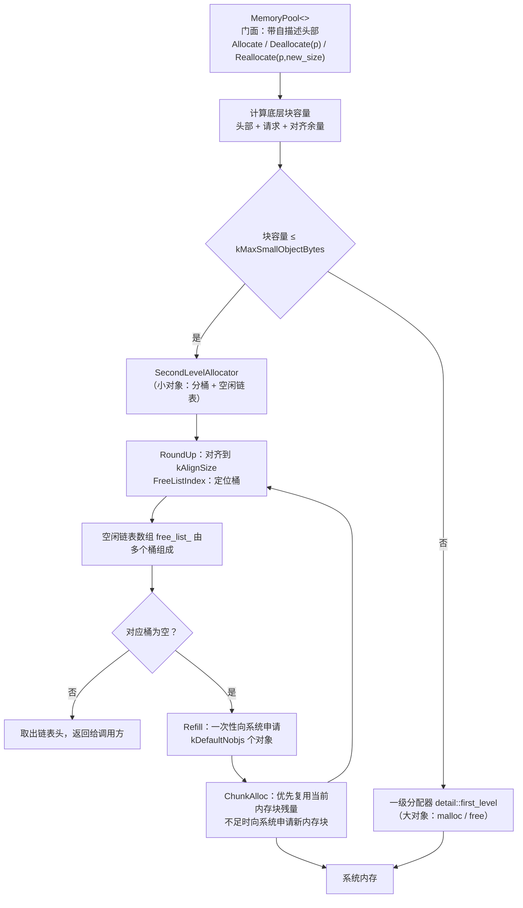

# MemSlice

> 一个轻量级、可定制的 C++20 内存池（Memory Pool）实现，内置两级分配器、STL 适配器与全局 `new`/`delete` 重载，旨在减少高频小对象分配的系统调用与内存碎片。

作者：Howland Mai　·　版权：© 2026　·　许可证：[MIT](LICENSE)


---

## 目录

- [MemSlice](#memslice)
  - [目录](#目录)
  - [简介](#简介)
  - [特性](#特性)
  - [工作原理](#工作原理)
  - [目录结构](#目录结构)
  - [构建与测试](#构建与测试)
    - [环境要求](#环境要求)
    - [构建](#构建)
    - [运行测试](#运行测试)
    - [集成到你的项目](#集成到你的项目)
  - [快速上手](#快速上手)
  - [自定义配置](#自定义配置)
  - [API 参考](#api-参考)
    - [`MemoryPool`](#memorypool)
    - [`Allocator<T>`](#allocatort)
    - [`DefaultConfig`](#defaultconfig)
  - [与 STL 容器配合](#与-stl-容器配合)
  - [性能说明](#性能说明)
  - [调试期哨兵](#调试期哨兵)
  - [注意事项](#注意事项)
  - [许可](#许可)
  - [贡献](#贡献)

---

## 简介

MemSlice 是一个用 C++20 编写的现代内存池库。它采用经典的两级分配器设计：

- **一级分配器（`detail::first_level`）**：直接封装 `malloc` / `free`，处理无法装进小对象块的大对象；行为不依赖配置，故为非模板的自由函数。
- **二级分配器（SecondLevelAllocator）**：将小对象按对齐后的大小分桶，通过空闲链表（free list）复用内存块，仅在链表耗尽时向系统批量申请大块内存。

它同时提供：

- 一个符合 STL 分配器规范的 `Allocator<T>`，可直接作为 `std::vector`、`std::list` 等容器的模板参数；
- 可选的全局 `operator new` / `operator delete` 重载，让整个程序的常规分配都走内存池。

核心实现为纯头文件模板，零第三方依赖，只依赖 C++ 标准库。

---

## 特性

- **两级分配器架构**：小对象走内存池复用，大对象透明回落到系统分配器；按**底层块容量**（含头部开销）路由。
- **零额外依赖**：只有标准库，头文件即库（`include/memory_pool.hpp` 伞头，或按需引 `include/memory_pool/` 下的子头）。
- **模板可定制**：通过 `Config` 模板参数自由调整对齐大小、小对象上限、批量申请粒度、线程安全开关。
- **内存复用与非碎片化**：基于大小分桶（bucketing）的空闲链表，释放的内存按尺寸回到对应桶，可直接复用。
- **分配失败兜底**：向系统申请失败时，会扫描空闲链表寻找可用内存，直至抛出 `std::bad_alloc`。
- **STL 分配器兼容**：内置可复用的 `Allocator<T>`。
- **可选全局重载**：链接 `src/global_new.cpp`（xmake 目标 `memory_pool_global`）即可启用全局 `new`/`delete` 加速（含 over-aligned 对齐重载）；不链接则不生效。
- **线程安全可选**：`Config::kThreadSafe` 默认开启；二级分配器**按桶独立加锁**（不同尺寸的分配/释放互不阻塞），可整体关闭以换取单线程零锁开销。
- **自描述头部**：每次分配在用户指针前放置 16 字节头部，记录真实基址与「块容量 | 来源」打包字。
  因此释放无需尺寸、重新分配无需旧尺寸——旧版「尺寸必须成对」的契约被彻底取消（见「注意事项」）。
- **资源可回收**：局部内存池实例析构时回收所有向系统申请的 chunk，不泄漏；无参 `delete` 亦能正确释放（全局池单例刻意不析构，见「注意事项」）。
- **调试期哨兵（可选、零开销）**：显式开启后，释放前校验头部魔数与分配状态位，把重复释放/野指针/头部损坏从静默堆损坏变成可定位的显式中止；默认关闭，该分支被 `if constexpr` 完全编译掉。
- **纯中文注释**：代码注释全部使用中文。
- **MIT 开源许可**。

---

## 工作原理



- **头部记账（Header Bookkeeping）**：`Allocate` 先按「头部 + 请求尺寸 + 对齐余量」算出底层块容量，再决定走哪一级分配器；返回给调用方的是头部之后的用户指针。
- **分桶（Bucketing）**：`RoundUp` 用位运算把块尺寸向上对齐到 `kAlignSize`（默认 8 字节），`FreeListIndex` 将其映射为固定桶索引。
- **批量申请（Batch Allocation）**：当某个桶为空时，`Refill` 一次向系统申请 `kDefaultNobjs`（默认 20）个对象，串成链表后按需交给调用方。
- **残量复用**：当当前 chunk 空间不足以满足整批时，会先消耗剩余空间，并把旧 chunk 的残量归还到对应桶，避免内存浪费。
- **回收与重分配**：`Deallocate(p)` / `Reallocate(p, new_size)` 都只读头部记录（真实基址、块容量、请求尺寸、来源）来决定回收去向与拷贝量，不再依赖调用方传入的旧尺寸。

---

## 目录结构

```
MemSlice/
├── xmake.lua                   # xmake 构建脚本（C++20，头文件库 + 全局重载库 + 测试/基准）
├── README.md                   # 本文件
├── LICENSE                     # MIT 许可证
├── .gitignore                  # 忽略 build/ 与编译产物
├── .clang-format               # 格式化配置（LLVM 基准，Google 风格）
├── include/
│   ├── memory_pool.hpp         # 伞头文件：转发包含下列全部子头（向后兼容入口）
│   └── memory_pool/
│       ├── config.hpp          # DefaultConfig 与线程安全开关探测
│       ├── block.hpp           # MemBlock、RawHeader 与对齐工具
│       ├── first_level.hpp     # 一级分配器（malloc / free / realloc）
│       ├── second_level.hpp    # 二级分配器（分桶空闲链表 + 分桶加锁、Refill、ChunkAlloc）
│       ├── pool.hpp            # MemoryPool 门面 + DefaultMemoryPool 声明
│       ├── allocator.hpp       # 带头部分配原语 + STL Allocator<T>
│       └── global_new.hpp      # 全局 new/delete 重载声明（需链接 memory_pool_global）
├── src/
│   ├── default_pool.cpp        # 全局池单例定义
│   └── global_new.cpp          # 全局 new/delete 重载实现
└── test/
    ├── test_utils.hpp          # 极简断言宏与用例自注册（零依赖）
    ├── test_main.cpp           # 入口：用例注册表遍历与命令行过滤
    ├── test_basic.cpp          # 基础分配/释放、自定义配置、零字节、大量分配
    ├── test_realloc.cpp        # Reallocate 数据保全与跨级切换
    ├── test_new_delete.cpp     # new/delete 重载、over-aligned、STL 分配器
    ├── test_guards.cpp         # 越界请求与错误尺寸释放的守卫
    ├── test_concurrency.cpp    # 多线程共享与 kThreadSafe=false
    ├── test_perf.cpp           # 性能基准（仅编入 bench_memory_pool）
    └── prof_memory_pool.cpp    # 剖析目标（仅编入 prof_memory_pool）
```

> 头文件之间依赖单向、无环：`config`/`block` ← `second_level` ← `pool` ← `allocator`；
> `global_new` 只含声明。每个子头均可独立包含（不依赖伞头），便于按需引用、缩小编译期依赖。

---

## 构建与测试

### 环境要求

- 支持 C++20 的编译器（`GCC ≥ 10`、`Clang ≥ 11`、`MSVC ≥ 19.29` 等）
- xmake `≥ 3.0`（推荐使用 clang 工具链：`set_toolchains("clang")` 已内置）
- 无需第三方依赖

### 构建

```bash
# 在项目根目录执行
xmake                    # 配置并编译全部目标
xmake -r                 # 强制全量重建
```

产物（位于 `build/linux/x86_64/release/`）：

| 目标                  | 类型       | 说明                                                       |
| --------------------- | ---------- | ---------------------------------------------------------- |
| `memory_pool`         | 头文件库   | 纯接口，仅提供 `MemoryPool` / `Allocator<T>`，无副作用     |
| `memory_pool_global`  | 静态库     | `default_pool.cpp` + `global_new.cpp`，全局 `new`/`delete` |
| `test_memory_pool`    | 可执行     | 功能测试套件（22 个用例）                                  |
| `bench_memory_pool`   | 可执行     | 性能基准（耗时较长，单独运行）                             |
| `prof_memory_pool`    | 可执行     | 剖析目标：供 callgrind 做指令级归因                        |

> **链接期选择副作用**：只有链接 `memory_pool_global`（`libmemory_pool_global.a`）才会启用全局 `new`/`delete` 重载。
> 只依赖 `memory_pool` 头文件目标时，程序内堆分配行为完全不变——这正是「只要 `Allocator<T>`，不要全局重载」的场景。

### 运行测试

```bash
xmake test                              # 推荐：构建 + 执行全部测试，失败即退出码非 0
xmake test test_memory_pool/basic       # 只跑某一组（组名见下表）
xmake run test_memory_pool              # 直接运行：全部用例
xmake run test_memory_pool basic        # 只运行 basic 组
xmake run test_memory_pool --quiet      # 静默模式
xmake run bench_memory_pool             # 性能基准
xmake run prof_memory_pool pool 20000 32 # 剖析目标（配 callgrind 使用）
# 或直接运行产物：
./build/linux/x86_64/release/test_memory_pool
```

> `xmake test` 是推荐的回归入口：它把用例进程的退出码接到构建系统，
> 测试失败会让命令以非 0 退出，因此可直接用于 CI 或提交前检查。

测试套件按组划分（`组.用例` 命名，命令行传组名即可只跑一组）：

| 组            | 覆盖内容                                                     |
| ------------- | ------------------------------------------------------------ |
| `basic`       | 基础分配 / 释放、自定义配置、零字节、大量小对象、载荷完整性 |
| `realloc`     | `Reallocate` 数据保全、跨级切换、增长链（8→…→4096→32）        |
| `new_delete`  | `new` / `delete`、`new[]` / `delete[]` 重载、over-aligned、STL 容器 |
| `guards`      | 越界守卫、尺寸误报不再崩溃（DEF-001）、无尺寸释放、调试哨兵   |
| `concurrency` | 4 线程共享一池、`kThreadSafe = false` 配置路径               |
| `perf`        | 内存池 vs 系统 `malloc` 基准（仅 `bench_memory_pool`）        |

> 回归用例（此前的缺陷已在对应用例中固化）：零字节分配无符号下溢、over-aligned 分配与分配器对齐、
> 二级分配器越界请求、`Reallocate` 尺寸误报导致的堆损坏（DEF-001）、无尺寸释放、并发安全。

> 构建与测试建议配合 `valgrind` / ASan 使用：
> `valgrind --leak-check=full ./build/linux/x86_64/release/test_memory_pool`
> 当前测试套件在 valgrind 下报告 0 泄漏、0 越界、0 数据竞争
> （`still reachable` 仅为全局池单例的刻意不析构内存，非泄漏）。

### 集成到你的项目

**方式一：仅使用头文件（推荐，最灵活）**

将 `include/memory_pool.hpp`（伞头）或 `include/memory_pool/` 子头目录拷贝到你的 include 路径直接包含即可，无需额外链接，也不会改变程序的全局分配行为。

```cpp
#include "memory_pool.hpp"                  // 全部接口（伞头）
#include "memory_pool/allocator.hpp"        // 或按需只引子头：STL 分配器
```

**方式二：作为 xmake 子工程**

在父工程的 `xmake.lua` 中以 `includes` 引入，并按需 `add_deps`：

```lua
includes("path/to/MemSlice")

target("your_target")
    set_kind("binary")
    add_files("src/*.cpp")
    add_deps("memory_pool")          -- 只要 MemoryPool / Allocator<T>，无副作用
    -- add_deps("memory_pool_global")  -- 额外启用全局 new/delete 重载
```

> `memory_pool` 是头文件库目标，仅提供接口；`memory_pool_global` 才会编译 `src/default_pool.cpp`
> 与 `src/global_new.cpp`，从而启用全局 `new`/`delete` 重载。是否需要全局重载由 `add_deps` 在链接期决定。

---

## 快速上手

```cpp
#include <iostream>
#include "memory_pool.hpp"

using namespace memory_pool;

int main() {
    MemoryPool<> pool;

    // 小对象走二级分配器；分配返回的指针前方带有自描述头部
    void* p = pool.Allocate(16);
    pool.Deallocate(p);              // 释放只需指针：尺寸由头部记录决定

    // 大对象回落一级分配器
    void* big = pool.Allocate(2048);
    pool.Deallocate(big);

    // 重新分配：只需给出新尺寸（旧尺寸以头部记录为准，数据会被正确拷贝）
    void* q = pool.Allocate(16);
    q = pool.Reallocate(q, 32);
    pool.Deallocate(q);

    // 使用 STL 分配器
    std::list<int, Allocator<int>> lst;
    lst.push_back(42);

    std::cout << "Success!" << std::endl;
    return 0;
}
```

---

## 自定义配置

通过模板参数传入配置结构体即可定制内存池行为：

```cpp
// 对齐到 16 字节，小对象上限 128 字节，每次批量申请 50 个对象
struct MyConfig {
  static constexpr size_t kAlignSize           = 16;
  static constexpr size_t kMaxSmallObjectBytes = 128;
  static constexpr size_t kDefaultNobjs        = 50;
};

MemoryPool<MyConfig> pool;
pool.Allocate(64);  // 按 16 字节对齐分桶
```

| 配置字段               | 默认值 | 说明                                               |
| ---------------------- | ------ | -------------------------------------------------- |
| `kMaxSmallObjectBytes` | 128    | 二级分配器管理的最大字节数，超过则走一级分配器     |
| `kAlignSize`           | 8      | 内存对齐大小（必须是 2 的幂）                      |
| `kDefaultNobjs`        | 20     | 桶耗尽时一次性向系统申请的对象数量                 |
| `kThreadSafe`          | true   | 二级分配器是否加锁（多线程共享同一池时请保持开启） |

> 配置合法性由 `static_assert` 校验：`kAlignSize` 必须为 2 的幂，且 `kMaxSmallObjectBytes` 必须是 `kAlignSize` 的整数倍。

---

## API 参考

### `MemoryPool`

```cpp
template <typename Config = DefaultConfig>
class MemoryPool {
public:
    MemoryPool();                                         // 构造
    MemoryPool(const MemoryPool&)            = delete;     // 禁止拷贝
    MemoryPool& operator=(const MemoryPool&) = delete;

    void* Allocate(size_t n);                              // 分配 n 字节
    void  Deallocate(void* p) noexcept;                    // 释放（尺寸由头部记录决定）
    void* Reallocate(void* p, size_t new_size);            // 重新分配为 new_size 字节
    size_t heap_size() const noexcept;                     // 已向系统申请的字节数
};
```

- `Allocate`：按**底层块容量**（头部 + 请求 + 对齐余量）路由——能装进小对象块就走二级分配器，否则回落一级分配器；失败抛出 `std::bad_alloc`。
- `Deallocate`：**不需要尺寸**。回收所需的真实基址与块容量都记录在用户指针前方的头部里；`p == nullptr` 时直接返回。
- `Reallocate`：**只需新尺寸**，旧尺寸以头部记录为准。全程走 `allocate + memcpy + deallocate`，不会把池内指针交给 `realloc`。`p == nullptr` 时等价于 `Allocate`。

> **契约简化**：旧版要求「释放时传入与分配一致的 `n`」，传错会导致错桶/堆损坏；自描述头部取消了这一契约——
> 现在**尺寸只影响拷贝量**，不再影响正确性。

### `Allocator<T>`

符合 STL 分配器要求的适配器，用于容器：

```cpp
template <typename T, typename Config = DefaultConfig>
class Allocator {
public:
    using value_type = T;
    using size_type = std::size_t;
    using difference_type = std::ptrdiff_t;
    using propagate_on_container_move_assignment = std::true_type;

    T* allocate(size_type n);                          // 分配 n 个 T
    void deallocate(T* p, size_type n) noexcept;       // 释放（忽略 n，以头部为准）
};
```

它经泄漏式单例 `DefaultMemoryPool()` 访问全局内存池，可跨容器共用同一内存池。
分配返回的内存保证满足 `alignof(T)`（含超对齐 `T`，如 `alignas(32)` 类型），
释放以头部记录为准，无需依赖传入的 `n`。

### `DefaultConfig`

```cpp
struct DefaultConfig {
    static constexpr size_t kMaxSmallObjectBytes = 128;
    static constexpr size_t kAlignSize           = 8;
    static constexpr int    kDefaultNobjs        = 20;
    static constexpr bool   kThreadSafe          = true;   // 可选：关闭可提升单线程性能
};
```

---

## 与 STL 容器配合

```cpp
#include <list>
#include <vector>
#include "memory_pool.hpp"

using namespace memory_pool;

std::list<int, Allocator<int>>   my_list;   // 链表节点从内存池分配
std::vector<double, Allocator<double>> vec; // 连续内存从内存池分配
```

内存池分配器满足 STL 分配器的最小要求（`value_type`、`allocate` / `deallocate`、`==` / `!=`），可与标准容器无缝协作。

---

## 性能说明

`xmake run bench_memory_pool` 内置 4 组基准：固定尺寸高频、尺寸混排、批量存活、
STL 分配器路径。基准只断言**自身有效性**（耗时为正、指针互不相同、堆用量增长、
循环未被优化器消除），比值仅作信息输出——因为「池是否更快」随平台与负载变化。

在本机（x86-64、clang -O2、glibc）实测的耗时构成（固定 32 字节、20 万次
分配 + 释放交替）：

| 路径                          | ns/op |
| ----------------------------- | ----- |
| `std::malloc` / `free`        | ~4.3  |
| 池，`kThreadSafe = false`     | ~4.8  |
| 池，默认（分桶加锁）          | ~12.3 |

> ⚠️ 结论要如实说：**默认配置下内存池单次分配并不比 `malloc` 快**。去掉锁之后
> 池与 `malloc` 基本持平（~4.8 vs ~4.3 ns/op），说明池自身的数据结构（分桶空闲
> 链表）是有竞争力的；差距来自每次分配/释放的加解锁成本，而 glibc 的 tcache
> 路径无锁。内存池值得采用的理由是**减少系统调用与内存碎片、分配延迟可预测**，
> 而不是单纯的单次分配更快。

**指令级归因**（`prof_memory_pool` + callgrind，每次 alloc+free 配对的指令数）：

| 路径                          | 指令/对 | 占比 |
| ----------------------------- | ------- | ---- |
| 系统 `malloc` + `free`        | 57      | —    |
| 池：`pthread_mutex_lock`      | 59      | 25%  |
| 池：`pthread_mutex_unlock`    | 52      | 22%  |
| 池：分桶核心逻辑 + 调用方     | 124     | 53%  |
| **池合计**                    | **235** | 4.1× |

> 关键证据：把 `kThreadSafe = false` 后单独测指令数，池为 **4,296,786**、
> `malloc` 为 **4,203,988**——**相差 0.2%，基本持平**。也就是说单线程下
> 池与 malloc 的差距**几乎全部来自锁**：每次分配/释放各取一次锁，
> 而无争用的 `std::mutex` lock+unlock 实测约 **7.9 ns**，
> 已接近 glibc 整个 malloc+free 的成本（约 4.3 ns）。
>
> 这也解释了为什么分桶加锁（见下）只在跨尺寸并发时有收益：单线程下
> 无论锁粒度多细，每次操作的加解锁成本都省不掉。要真正消除它需要
> thread-local 缓存（代价是跨线程归还的所有权问题，尚未实现）。
>
> 复现方式：
> ```bash
> xmake                                   # 构建 prof_memory_pool
> valgrind --tool=callgrind --callgrind-out-file=/tmp/cg.out \
>          ./build/linux/x86_64/release/prof_memory_pool pool 20000 32
> callgrind_annotate --auto=no /tmp/cg.out
> ```

**多线程吞吐**（4 线程 × 5 万次，见 `bench_memory_pool` 的 `multithread_throughput`）：

| 场景                                  | ns/op |
| ------------------------------------- | ----- |
| 各线程使用不同尺寸（命中不同桶）      | ~123  |
| 各线程使用相同尺寸（争用同一把桶锁）  | ~243  |

> 分桶加锁的效果集中体现在「不同尺寸并发」这一场景：各桶独立加锁后互不阻塞，
> 吞吐约为同桶争用时的 2 倍。若你的负载集中在少数几个固定尺寸上，收益会明显
> 小于此值——此时瓶颈是同桶争用，进一步优化需要 thread-local 缓存（代价是
> 需要处理跨线程归还的所有权问题）。

---

## 调试期哨兵

默认关闭、零开销。开启后每次释放都会校验头部魔数与分配状态位，可把
**重复释放、释放野指针、头部被越界写坏**这类误用从「静默的堆损坏」变成
带明确信息的显式中止（`abort`，因为此时堆已损坏，继续跑只会离现场更远）。

```bash
# 本工程：把宏直接传给编译器（已验证生效）
xmake f --cxflags="-DMEMSLICE_DEBUG_CHECKS=1" && xmake -r
# 自己的工程：同样定义该宏即可
#   -DMEMSLICE_DEBUG_CHECKS=1
```

> 注意：`xmake f` 的多次调用会互相覆盖配置，设置时请把该选项与其他
> `xmake f` 参数写在同一条命令里（或设置后不要再调用 `xmake f`）。
> 本工程未使用 xmake 的 `option()`/`has_config()` 包装——实测在本环境
> （xmake 3.0.6）该组合读不到配置值，故采用最直接且可验证的 `-D` 方式。

也可通过自定义配置逐池覆盖：`struct MyConfig { static constexpr bool kDebugChecks = true; ... };`

检测能力（均有测试用例覆盖，见 `guards.sentinel_*`）：

| 误用                                | 关闭时（默认）            | 开启时                          |
| ----------------------------------- | ------------------------- | ------------------------------- |
| 重复释放同一指针（double free）     | 静默破坏空闲链表          | 报「检测到重复释放」并中止      |
| 释放非本池分配的指针                | 静默错桶 / 堆损坏         | 报「头部校验失败」并中止        |
| 头部被越界写坏                      | 静默错桶 / 堆损坏         | 报「头部校验失败」并中止        |

> **实现代价**：魔数与状态位内嵌在头部已有的打包字里（复用低 9 位），
> 因此**头部仍为 16 字节，不因诊断能力增加每次分配的内存开销**。
> 开启校验时代价是每次释放多两次比较；关闭时（默认）该分支被
> `if constexpr` 完全编译掉——已用 `nm` 核实产物中不含任何哨兵符号。

> **为什么不用 `#ifdef NDEBUG` 自动判断**：构建系统未必定义 `NDEBUG`
> （例如 xmake 的 release 模式默认就不定义），依赖它会让发布构建静默保留
> 校验、或让调试构建悄悄丢掉诊断能力，两种都难以察觉。故改为显式的
> `MEMSLICE_DEBUG_CHECKS` 宏，默认关闭（零开销即默认行为）。

---

## 注意事项

- **全局 `new`/`delete` 重载**：链接 `src/global_new.cpp` 会把程序内**所有**常规堆分配（包括标准库内部）都导向内存池。每个分配都在对象头记录真实基址与尺寸，无参 `delete` 也能正确回收；并额外提供了 over-aligned（`std::align_val_t`）重载。作为通用工具时需权衡；若只想服务指定的容器，建议只使用 `Allocator<T>`，而不要链接 `memory_pool_global` 目标。
- **对齐契约**：普通 `new`、`new[]`、`Allocator<T>` 一律返回 `max_align_t`（16 字节）及以上对齐的内存，超对齐请求（如 `alignas(64)`）按请求对齐返回——完全满足 C++ 对齐契约。代价是每个分配都要带一个 32 字节的自描述头部。
- **尺寸不再是契约（自描述头部）**：每一次分配都在用户指针前方放置头部，记录真实基址、底层块容量、请求尺寸与来源。因此 `Deallocate(p)` 无需尺寸，`Reallocate(p, new_size)` 只需新尺寸——旧版「必须传入与分配一致的 `n`，否则错桶/堆损坏」的契约已被取消，尺寸现在只影响拷贝量、不影响正确性。
- **二级分配器口径唯一**：`SecondLevelAllocator` 的 `Allocate/Deallocate` 一律以**底层块容量**为准（头部开销与对齐余量由 `MemoryPool` 计入），不存在第二套尺寸语义；越界请求在分配侧抛 `std::bad_alloc`，释放侧调试构建触发断言、发布构建丢弃。
- **线程安全**：`Config::kThreadSafe` 默认开启。二级分配器采用**分桶加锁**：每个尺寸桶各持一把锁，chunk 游标另持一把，加锁顺序固定为「先 chunk 后桶」。因此不同尺寸的分配/释放可真正并发（实测各线程命中不同桶时吞吐显著优于同桶争用），只有同尺寸的高频访问才会争用同一把锁。若确信只在单线程使用，设 `kThreadSafe = false` 可消除全部加锁开销。
- **全局池为泄漏式单例**：`DefaultMemoryPool()` 采用函数内 `static` + placement new 构造，刻意永不析构。这保证了：构造期（其它全局对象构造中执行 `new`）与退出期（其它全局对象析构中执行 `new`/`delete`）都不会撞上未初始化或已释放的池。代价是该池及其 chunk 在程序生命周期内不归还系统（valgrind 报告为 `still reachable`，非泄漏）。
- **已知 ABI 限制**：`new T[n]` 且 `T` 对齐为 16、带非平凡析构（数组含 8 字节 cookie）时，元素起始地址为「分配基址 + 8」，可能出现 8 字节对齐而非 16 字节对齐。这是 GCC/Clang 与 libstdc++ 默认分配器一致的标准行为（x86-64 上通常无碍），如需此类数组的严格 16 对齐，建议对元素类型使用 `alignas(32)` 以上（走 over-aligned 路径）。

---

## 许可

本项目以 [MIT License](LICENSE) 发布。版权所有 © 2026 **Howland Mai**。

> 所有源文件头部均包含版权声明，完整的许可证文本见仓库根目录的 [LICENSE](LICENSE) 文件。

---

## 贡献

欢迎提交 Issue 与 PR。提交前请：

1. 运行 `xmake` 确保编译通过；
2. 运行 `xmake test` 确保全部测试通过（退出码非 0 即失败）；
3. 尽量遵循 `.clang-format` 的代码风格。

---

**MIT License · Copyright © 2026 Howland Mai**
